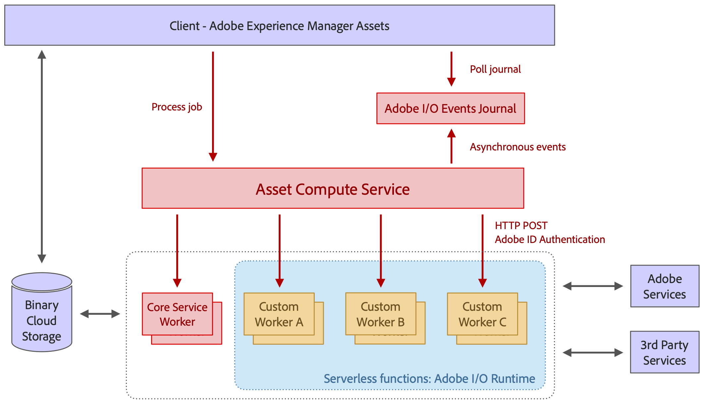

# Architectuur van [!DNL Asset Compute Service] {#overview}

De [!DNL Asset Compute Service] is gebouwd op het Adobe [!DNL `I/O Runtime`] -platform zonder server. Het biedt ondersteuning voor Adobe Sensei-inhoudsservices voor elementen. De aanroepende client (alleen [!DNL Experience Manager] als a [!DNL Cloud Service] wordt ondersteund) wordt voorzien van de door Adobe Sensei gegenereerde informatie die de client voor het element heeft gezocht. De geretourneerde informatie heeft de JSON-indeling.

[!DNL Asset Compute Service] kan worden uitgebreid door aangepaste toepassingen te maken op basis van [!DNL Adobe Developer App Builder] . Deze aangepaste toepassingen zijn apps zonder kop en voeren taken uit zoals aangepaste conversieprogramma&#39;s toevoegen of externe API&#39;s aanroepen om afbeeldingsbewerkingen uit te voeren.[!DNL Project Adobe Developer App Builder]

[!DNL Project Adobe Developer App Builder] is een framework voor het ontwikkelen en implementeren van aangepaste webtoepassingen op de Adobe [!DNL `I/O Runtime`] . Voor het maken van aangepaste toepassingen kunnen ontwikkelaars [!DNL React Spectrum] (Adobe UI-toolkit) gebruiken, microservices maken, aangepaste gebeurtenissen maken en API&#39;s ordenen. Zie [&#x200B; documentatie van Adobe Developer App Builder &#x200B;](https://developer.adobe.com/app-builder/docs/overview).

De basis waarop de architectuur is gebaseerd, is onder meer:

* De modulariteit van toepassing-slechts die wat voor een bepaalde taak-vereist bevat staat toe om toepassingen van elkaar te loskoppelen en hen lichtgewicht te houden.

* Het serverloze concept van [!DNL Adobe I/O] Runtime levert talrijke voordelen op: asynchrone, hoogst scalable, geïsoleerde, op baan-gebaseerde verwerking, die voor activaverwerking perfect past.

* Binaire cloudopslag biedt de benodigde functies voor het afzonderlijk opslaan en openen van elementbestanden en uitvoeringen, zonder dat volledige toegangsrechten voor de opslag vereist zijn, met behulp van vooraf ondertekende URL-verwijzingen. Dankzij overdrachtsversnelling, CDN-caching en colocatie van computertoepassingen met cloudopslag hebt u optimale toegang tot content met lage latentie. Zowel AWS- als Azure-wolken worden ondersteund.

*Cijfer: Architectuur van [!DNL Asset Compute Service] en hoe het met [!DNL Experience Manager], opslag, en verwerkingstoepassing integreert.*

De architectuur bestaat uit de volgende onderdelen:

* **API en de organisatielaag** ontvangt verzoeken (in formaat JSON) die de dienst instrueren om een bronactiva in veelvoudige vertoningen om te zetten. De aanvragen zijn asynchroon en retourneren met een activerings-id die taak-id is. Instructies zijn louter declaratief en voor alle standaardverwerkingsbewerkingen (bijvoorbeeld het genereren van miniaturen en het extraheren van tekst) geven consumenten alleen het gewenste resultaat op, maar niet de toepassingen die bepaalde uitvoeringen verwerken. Algemene API-functies zoals verificatie, analyse en snelheidsbeperking worden vóór de service afgehandeld met de Adobe API Gateway en beheren alle aanvragen die naar [!DNL Adobe I/O] Runtime gaan. De toepassing die verplettert wordt dynamisch gedaan door de orchestratielaag. Clients definiëren aangepaste toepassingen voor bepaalde uitvoeringen, die met hun eigen set unieke parameters worden geleverd. De uitvoering van de toepassing kan volledig parallel verlopen omdat het afzonderlijke serverfuncties in Adobe [!DNL `I/O Runtime`] zijn.

* **Toepassingen om activa** te verwerken die in bepaalde soorten dossierformaten of doelvertoningen specialiseren. Conceptueel is een toepassing vergelijkbaar met het UNIX® pipe-concept: een invoerbestand wordt omgezet in een of meer uitvoerbestanden.

* **a [&#x200B; gemeenschappelijke toepassingsbibliotheek &#x200B;](https://github.com/adobe/asset-compute-sdk)** behandelt gemeenschappelijke taken. Bijvoorbeeld het downloaden van het bronbestand, het uploaden van de uitvoeringen, het rapporteren van fouten, het verzenden van gebeurtenissen en het controleren. Dit ontwerp zorgt ervoor dat de ontwikkeling van toepassingen eenvoudig blijft, waarbij het serverloze concept wordt gebruikt en interactie beperkt blijft tot het lokale bestandssysteem.

<!-- TBD:

* About the YAML file?
* minimize description to custom applications
* remove all internal stuff (e.g. Photoshop application, API Gateway) from text and diagram
* update diagram to focus on 3rd party custom applications ONLY
* Explain important transactions/handshakes?
* Flow of assets/control? See the illustration on the Nui diagrams wiki.
* Illustrations. See the SVG shared by Alex.
* Exceptions? Limitations? Call-outs? Gotchas?
* Do we want to add what basic processing is not available currently, that is expected by existing AEM customers?
-->
